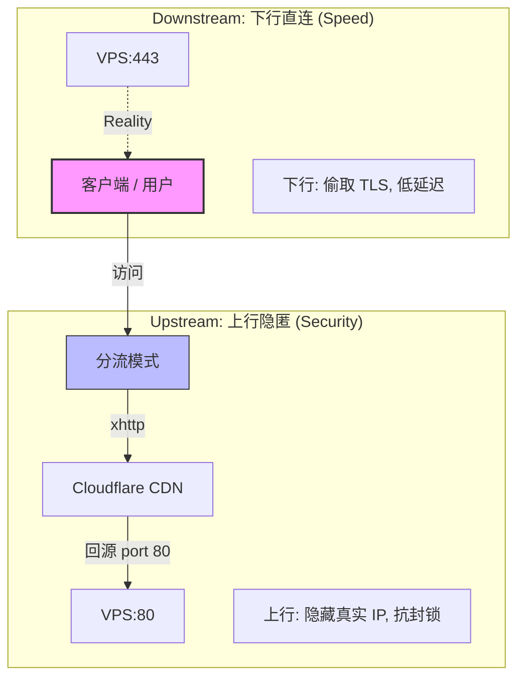

# 🛠️ XHTTP + Reality Script


> **声明**: 本项目仅用于技术研究和合法用途，请遵守当地法律法规，勿用于非法用途；请勿用于生产环境。

> **注意**: 在使用此项目和教程过程中，若因违反以上声明使用规则而产生的一切后果由使用者自负。

**如果觉得项目有用，请点个 ⭐️ Star 支持一下！**

---
## ❗❗❗必要前提： 你的vps需要事先在Cloudflare做好域名解析！！！ 否则不用继续了。
---

# 📖 项目简介
****XHTTP + Reality Script**** 是一个Xray一键部署脚本，专为在 VPS 上部署 Xray (VLESS + xhttp + Reality) 而设计。

安装脚本支持 **上行 xhttp + Cloudflare CDN** 隐藏流量特征，**下行 Reality 直连** 保证低延迟与高性能。

另外，本脚本都能通过完善的 CLI 参数体系与 **Identity as State** 的设计理念，为您提供可复现、可审计的一站式体验。

---

# ✨ 核心架构: 上下行分流 (Traffic Splitting)

本架构采用了 **上行 CDN 隐匿** 与 **下行 Reality 直连** 相结合的机制，实现了高隐蔽性与低延迟的完美平衡。


### 🎲 模式 A：随机身份 (Random Mode)

原理：若本地不存在 `identity.json`，脚本将自动随机生成 UUID 和 Key 并落盘保存。

***优势: 适合快速部署，开箱即用，全自动管理身份生命周期。***

### 🔒 模式 B：固定身份 (Fixed Mode)

原理：通过 CLI 参数指定 UUID，或者复用已存在的 `identity.json` 文件。

***优势: 适合多节点统一管理、迁移恢复，保证配置的“可复现”与“可审计”。***

---

# 🚀 快速开始

### ✅ 系统要求
* **系统**: Debian 10+ / Ubuntu 20.04+
* **架构**: amd64 / arm64
* **权限**: 需要 root
* **环境**: systemd

### 📥 安装（推荐：随机身份）

**推荐（安全方式）**：

```bash
curl -fsSL https://raw.githubusercontent.com/kungwu222/xhttp_reality/refs/heads/main/xhttp-reality.sh \
-o xhttp-reality.sh
chmod +x xhttp-reality.sh
./xhttp-reality.sh -i -d your.domain

```

**一行命令（快速）**: 
```bash
curl -fsSL https://raw.githubusercontent.com/kungwu222/xhttp_reality/refs/heads/main/xhttp-reality.sh \
| bash -s -- -i -d your.domain

```

**安装完成后会：**
1. 安装 Xray
2. 随机生成身份并落盘 (`/usr/local/etc/xray/identity.json`)
3. 写入配置并启动服务
4. **自动输出客户端可用的分享链接 (VLESS)**
5. **创建快捷方式命令，可用 sr 再次运行脚本**

### 🛠 安装（高级：固定身份）
```bash
./xhttp-reality.sh -i -d your.domain -m fixed
```
**说明：**
使用代码内默认的固定身份配置和通过CLI参数传入的配置参数生成XRAY身份配置。 

# 🧭 CLI 参数说明
| 参数                  | 说明                       |
| ------------------- | ------------------------ |
| `-i`, `--install`   | 安装并部署                    |
| `-u`, `--uninstall` | 卸载并清理                    |
| `-s`, `--status`    | 查看运行状态                   |
| `-d`, `--domain`    | Cloudflare 域名（必填）        |
| `-l`, `--link`    | 可用快捷命令 `sr -l` 显示节点配置       |
| `-m`, `--mode`      | 身份模式：`random` / `fixed`  |
| `-n`, `--nodename`  | 可自定义节点名称，默认 xhttp-reality  |
| `--uuid-xhttp`      | fixed 模式下指定 xhttp UUID   |
| `--uuid-reality`    | fixed 模式下指定 reality UUID |
| `--domain-sni`      | reality 域名sni（默认 www.icloud.com）        |
| `version`           | 输出脚本版本                   |


# ☁️ Cloudflare 注意事项
***端口限制: Cloudflare 橙云代理 (CDN) 只支持回源到特定端口。***

xhttp 套 CDN 时: 必须监听 80 端口 (或通过 443 fallback)，
否则自行到cloudflare设置fallback端口。


# 📱 客户端使用
安装完成后，脚本会自动生成客户端配置文件：

```bash
/usr/local/etc/xray/client-link.txt
```
包含可直接导入的 vless:// 分享链接，完美支持：

v2rayN

sing-box

nekobox

# 📊 查看状态 / 节点配置 / 卸载

### 查看状态
```bash
sr -s
```
### 查看节点配置
```bash
sr -l
```
### 卸载 (停止服务、删除配置及 identity.json)
```bash
sr -u
```
